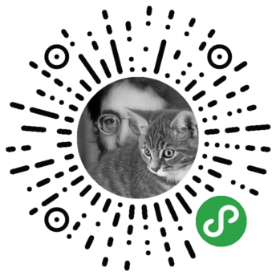

# 关于作者

### 公众号

我在业余时间运营了两个公众号。

「漫步大前端」聚焦于大前端技术分享，包括但不限于Android、iOS、Web 前端、小程序和 Flutter，欢迎关注和投稿。

「wenhaiz」是用于记录生活感想的地方，欢迎关注。

### 工作机会

可扫描小程序码获取我的个人简历。

### 赞赏

如果你觉得我的整理对你有帮助，可以选择赞赏，激励我做的更好，感谢！  

