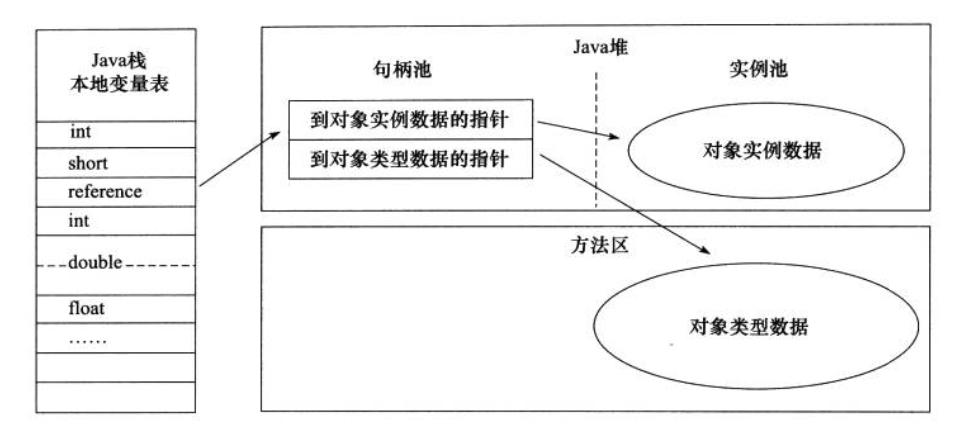

# 并发编程

### 如何开启一个 Java 线程？

* 继承`Thread` 类并重写 run 方法，将要执行的任务放到run方法中，然后创建Thread 对象并调用 start 方法。
* 实现 `Runnable` 接口，将要执行的任务放到run方法中，然后通过Thread 构造方法传入该 Runable 对象，然后调用Thread 对象的 start 方法启动线程
* 实现 `Callable` 接口，并通过 Callable 对象创建 `FutureTask` 对象，然后将 FutureTask 对象传入 Thread 构造方法创建线程，调用 start 方法启动线程，可以通过 FutureTask 的 `get` 方法获取执行结果。
* 通过线程池来根据需要开启线程

### 销毁一个线程的方法呢？

* 任务执行完后自动结束
* 设置结束标识，并通过检查标识在run方法中 return 
* 调用线程的 interrupt 方法来中断线程。如果线程处于阻塞状态，会抛 InterruptedException ，可以捕捉这个异常并停止执行任务；如果线程处于非阻塞状态，可通过调用 `isInterrupted` 来判断线程已经被中断，然后执行资源释放等工作结束线程
* 调用stop方法强制停止线程。stop方法已经被废弃，使用此方法结束线程可能导致资源不能被正确释放、数据的线程安全无法得到保障以及引发 SecurityException（SecurityManage 会通过checkAccess 检查当前线程没有权限结束这个线程）。

> stop 会是线程释放持有的所有的锁，如果被所保护的资源处于一个中间态（非正常），那么它将会被其他线程访问到，因此会导致无法预料的行为，使程序变得不可靠。

> [Java中的线程Thread方法之—stop\(\)](http://www.520monkey.com/archives/185)

### Runnable 和 Callable 有什么区别和联系？

* 定义不同：他们都是用于定义任务的接口。Runable 有一个  run 方法 ，该方法无返回值；而 Callable 有一个 call 方法，**可以抛出受检异常，可以有返回值**，通常用于需要返回执行结果的情况。
* 出现时间不同：Runnable 字 Java 1.0 起就有了，而 Callable 是 1.5 引入的。
* 启动方式不同：都可以通过线程执行，不过 Runnable 可以作为参数直接传到 Thread 的构造方法中，而Callable 需要先构造 FutureTask 对象，然后再通过 FutureTask 对象创建 Thread 对象，执行结果通过 FutureTask 的 get  方法获取。

#### Runnable 接口定义

```text
@FunctionalInterface
public interface Runnable {
    /**
     * When an object implementing interface <code>Runnable</code> is used
     * to create a thread, starting the thread causes the object's
     * <code>run</code> method to be called in that separately executing
     * thread.
     * <p>
     * The general contract of the method <code>run</code> is that it may
     * take any action whatsoever.
     *
     */
    public abstract void run();
}
```

#### Callable 接口定义

```text
@FunctionalInterface
public interface Callable<V> {
    /**
     * Computes a result, or throws an exception if unable to do so.
     *
     * @return computed result
     * @throws Exception if unable to compute a result
     */
    V call() throws Exception;
}
```


### 同步和异步？

同步和异步的区别主要在于调用发出后是否需要等待。如果需要等待，则成调用（方法）是同步的，否则称调用（方法）是异步的。

### 阻塞调用和非阻塞调用？

阻塞主要用于描述线程状态：阻塞状态就是说当线程中调用某个函数，例如IO请求或者暂时得不到竞争资源的，操作系统会把该线程阻塞起来，避免浪费CPU资源，等到得到了资源，再变成就绪状态，等待CPU调度运行。

阻塞调用是指调用结果返回之前，调用者会进入阻塞状态等待。只有在得到结果之后才会返回。非阻塞调用是指在不能立刻得到结果之前，该函数不会阻塞当前线程，而会立刻返回。

* 同步阻塞调用：得不到结果不返回，线程进入阻塞态等待。
* 同步非阻塞调用：得不到结果不返回，线程不阻塞一直在CPU运行。
* 异步阻塞调用：去到别的线程，让别的线程阻塞起来等待结果，自己不阻塞。
* 异步非阻塞调用：去到别的线程，别的线程一直在运行，直到得出结果。

### 并发与并行？

并发是指一个时间段内，有几个程序都在同一个CPU上运行，但**任意一个时刻点上只有一个程序在处理器上运行**。

并行是指一个时间段内，有几个程序都在几个CPU上运行，**任意一个时刻点上，有多个程序在同时运行**，并且多道程序之间互不干扰。

并发只是任务之间切换过快导致看起来是多任务同时执行，并行是真正的多任务同时执行。两者区别如下图:


 [深入理解并发 / 并行，阻塞 / 非阻塞，同步 / 异步](https://juejin.im/entry/58ae4636b123db0052b1caf8)

### Thread 的 join\(\) 有什么作用？

等待线程结束。如果线程 A 调用了线程 B 的join方法，则线程A会等待线程B结束后再进行后续操作。

### 线程有哪些状态？

#### 通用线程状态


#### Java 线程状态

1. NEW（初始化状态）
2. RUNNABLE（可运行 / 运行状态）
3. BLOCKED（阻塞状态）
4. WAITING（无时限等待）
5. TIMED\_WAITING（有时限等待）
6. TERMINATED（终止状态）

> BLOCKED、WAITING、TIMED\_WAITING 可以理解为线程导致休眠状态的三种原因。



#### 线程状态转换

**1. RUNNABLE 与 BLOCKED 的状态转换**

只有一种场景会触发这种转换，就是线程等待 synchronized 的隐式锁。synchronized 修饰的方法、代码块同一时刻只允许一个线程执行，其他线程只能等待，这种情况下，等待的线程就会从 RUNNABLE 转换到 BLOCKED 状态。而当等待的线程获得 synchronized 隐式锁时，就又会从 BLOCKED 转换到 RUNNABLE 状态。

**2. RUNNABLE 与 WAITING 的状态转换**

第一种场景，获得 synchronized 隐式锁的线程，调用无参数的 Object.wait\(\) 方法。

第二种场景，调用无参数的 Thread.join\(\) 方法。其中的 join\(\) 是一种线程同步方法，例如有一个线程对象 thread A，当调用 A.join\(\) 的时候，执行这条语句的线程会等待 thread A 执行完，而等待中的这个线程，其状态会从 RUNNABLE 转换到 WAITING。当线程 thread A 执行完，原来等待它的线程又会从 WAITING 状态转换到 RUNNABLE。

第三种场景，调用 LockSupport.park\(\) 方法。调用 LockSupport.park\(\) 方法，当前线程会阻塞，线程的状态会从 RUNNABLE 转换到 WAITING。调用 LockSupport.unpark\(Thread thread\) 可唤醒目标线程，目标线程的状态又会从 WAITING 状态转换到 RUNNABLE。

**3.  RUNNABLE 与 TIMED\_WAITING 的状态转换**

* 调用带超时参数的 Thread.sleep\(long millis\) 方法；
* 获得 synchronized 隐式锁的线程，调用带超时参数的 Object.wait\(long timeout\) 方法；
* 调用带超时参数的 Thread.join\(long millis\) 方法；
*  调用带超时参数的 LockSupport.parkNanos\(Object blocker, long deadline\) 方法；
*  调用带超时参数的 LockSupport.parkUntil\(long deadline\) 方法。

TIMED\_WAITING 和 WAITING 状态的区别，仅仅是触发条件多了超时参数。

**4.从 NEW 到 RUNNABLE 状态**

Java 刚创建出来的 Thread 对象就是 NEW 状态，NEW 状态的线程，不会被操作系统调度，因此不会执行。Java 线程要执行，就必须转换到 RUNNABLE 状态。从 NEW 状态转换到 RUNNABLE 状态很简单，只要调用线程对象的 start\(\) 方法就可以了。

**5. 从 RUNNABLE 到 TERMINATED 状态**

线程执行完 run\(\) 方法后，会自动转换到 TERMINATED 状态，当然如果执行 run\(\) 方法的时候异常抛出，也会导致线程终止。也可以手动终止线程（注意 stop\(\) 和 interrupt\(\)方法 ）。

> [Java并发编程实战 ：09  \| Java 线程（上）](https://time.geekbang.org/column/article/86366)
>
> [Java并发编程之锁机制之 LockSupport 工具](https://juejin.im/post/5bdc1142e51d45052c6fede7)

### 什么是线程安全？保障线程安全有哪些手段？

### ReentrantLock 和 synchronized的区别?

### synchronized 和 volatile的区别？

### synchronized 同步代码块还有同步方法本质上锁住的是谁？为什么？

### sleep\(\) 和 wait\(\) 的区别？

### 什么是乐观锁?

乐观锁：假设每次去拿数据都认为别人不会修改，所以不会上锁。但是在更新的时候会判断一下此期间别人有没有去更新这个数据。一般用在读比较多，写比较少的情况。

悲观锁：假设每次都是最坏情况，每次去拿数据时别人都会修改，所以每次拿数据的时候都会上锁，这样别人想拿这个数据就会被阻塞直到它拿到锁，多写少读时使用。

### Volatile 关键字作用

1. 强制CPU读取数据时不使用缓存，而是直接通过内存读取，可以保证可见性，不保证原子性
2. 禁止编译器进行指令重排序

