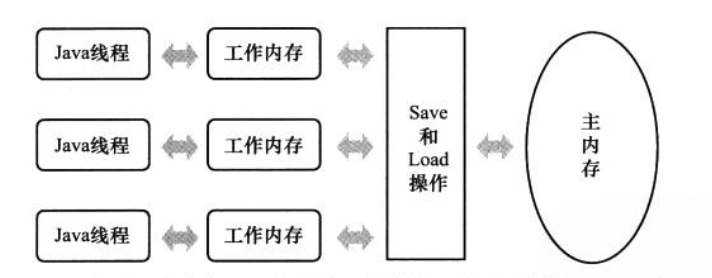

# Java 内存模型（JMM）

Java 虚拟机规范中定义了 Java 内存模型用于屏蔽各种硬件和操作系统的内存访问差异，以实现让 Java 程序在各种平台上都能达到一致的内存访问效果。

> JDK 1.5 发布后，JMM 开始成熟和完善起来。

JMM 的主要目标是定义程序中各个变量的访问规则，即将变量存储到内存和从内存中读取变量这样的底层细节。这里的变量报错实例变量、静态字段、构成数组的元素等，但不包括方法中的局部变量，因为他们是线程私有的，不会存在竞争问题

## 主内存和工作内存

JMM 规定所有变量都存储在主内存（Main Memory）中，每条线程有自己的工作内存（Working Memory），工作内存中保存了线程引用到的变量在主内存中的拷贝。**线程对变量的操作都必须在工作内存中，而不能直接读写主内存的变量。**不同线程之间也无法直接访问对方的工作内存，线程间的变量传递须通过主内存完成。

## 内存间的交互操作

JMM 定义了一下8种操作来完成工作内存与主内存间的交互，虚拟机必须保证它们是原子的（对于long和double类型的变量，load/store/read/write操作在某些平台上允许有例外）。

| 指令 | 操作对象 | 作用 |
| :--- | :--- | :--- |
| lock（锁定） | 主内存的变量 | 把一个变量标识为一条线程独占的状态 |
| unlock\(解锁\) | 主内存的变量 | 把一个变量从锁定的状态释放出来，释放后的变量可以被其他线程锁定 |
| read\(读取\) | 主内存的变量 | 把一个变量的值从主内存传输到线程的工作内存中，以便后续load指令使用 |
| load\(载入\) | 工作内存的变量 | 把read操作从主内存中获得的变量值放入工作内存的变量副本中 |
| use\(使用\) | 工作内存的变量 | 把工作内存中一个变量的值传递给执行引擎，每当虚拟机遇到一个需要使用到变量值得字节码指令时会执行这个操作 |
| assign\(赋值\) | 工作内存的变量 | 把一个从执行引擎得到的值，赋值给工作内存中的变量，每当虚拟机遇到一个给变量赋值的操作时会执行这个操作 |
| store\(存储\) | 工作内存中的变量 | 把工作内存中变量的值传送到主内存中，以便write操作使用 |
| write\(写入\) | 主内存的变量 | 把store操作从工作内存获得的变量值放入到主内存的变量中 |

要把一个变量从主内存复制到工作内存，需要顺序的执行read和load操作；要把变量从工作内存同步到主内存，需要顺序执行store和load操作。顺序执行不代表连续执行，中间可以插入其他指令。

### 八种操作满足的规则

* 不允许 read和load、store和write的操作之一单独出现，即不允许从主内存读取了变量但工作内存不接受或者从工作内存发起写回但主内存不接受的情况发生
* 不允许线程丢弃它的assign操作，即变量在工作内存中发生变化后必须同步到主内存
* 不允许一个线程无原因的（未发生assign操作）把数据从工作内存同步回主内存
* 一个新的变量只能从主内存中「诞生」，不允许在工作内存中直接使用一个未被初始化\(load、assign\)的变量，即对一个变量执行use、store之前，必须已经执行过load和assign操作
* 一个变量在同一时刻只允许一条线程对其进行lock操作，但lock操作可以被同一线程重复多次执行，多次lock后，只有执行同样次数的unlock变量才会被解锁
* 如果变量没有被lock，那么不允许对其进行unlock，也不允许unlock一个被其他线程lock的变量
* 如果对一个变量执行lock操作，将会清空工作内存中此变量的值，在执行引擎使用这个变量前，需要重新执行load或assign操作初始化变量的值
* 对一个变量unlock之前，必须先将变量的值同步回主内存

## 在Java内存模型有哪些可以保证并发过程的原子性、可见性和有序性的措施？

* 原子性：内存间交互操作 read、load、assign、use、store、write指令。（除long和double的非原子协定，未被volatile 修饰时，拆成两个32位），synchronized 关键字（lock和unlock）
* 可见性：volatile 关键字，synchronized\(unlock之前要把变量同步到主内存\) 和 final（在构造器中初始化完成，且this指针没有被传递出去，其他线程可以看到该final字段）
* 有序性：volatile禁止指令重排序、**happens-before 原则**

## Happens-before 原则

操作A 先行发生于操作B，就是在发生操作B之前，操作A产生的影响（修改共享变量、发送消息、调用方法等）能被操作B观察到。

* 程序次序规则：在一个线程内，按照代码控制流顺序，前面的操作先行发生于后面的操作
* 管程锁定规则：对**同一个锁**的unlock 先行发生于后面对它的lock
* volatile 变量规则：对volatile 变量的写操作先行发生于对它的读操作
* 线程启动规则：Thread 对象的start 方法先行发生于此线程的每一个动作
* 线程终止规则：线程中所有操作先行发生于对此线程的终止检测（Thead.join/isAlive）
* 线程中断规则：对线程 interrupt 方法调用先行发生于被中断线程检测到中断事件的发生
* 对象终结规则 ：一个对象的初始化完成（构造方法执行结束）先行发生于它的finalize\(\)方法执行
* 传递性：如果操作A先行发生于操作 B，操作B先行发生于操作C，那么操作A先行发生于操作C

> 时间上的先后与是否先行发生没有必然联系 。

todo ：如何实现的？

### 

