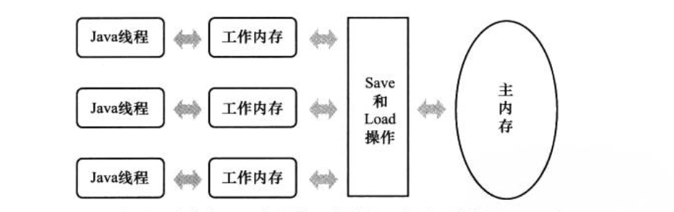

# Java 内存模型

## 工作内存和主内存的关系？

所有变量都存储在主内存中，每条线程有自己的工作内存，工作内存中保存了线程引用到的变量在主内存的拷贝。**线程对变量的操作都必须在工作内存中，而不能直接读写主内存的变量。**不同线程之间也无法直接访问对方的工作内存，线程间的变量传递须通过主内存完成。

## 在Java内存模型有哪些可以保证并发过程的原子性、可见性和有序性的措施？

* 原子性：内存间交互操作 read、load、assign、use、store、write指令。（除long和double的非原子协定，未被volatile 修饰时，拆成两个32位），synchronized 关键字（lock和unlock）
* 可见性：volatile 关键字，synchronized\(unlock之前要把变量同步到主内存\) 和 final（在构造器中初始化完成，且this指针没有被传递出去，其他线程可以看到该final字段）
* 有序性：volatile禁止指令重排序、**happens-before 原则**

## Happens-before 原则

操作A 先行发生于操作B，就是在发生操作B之前，操作A产生的影响（修改共享变量、发送消息、调用方法等）能被操作B观察到。

* 程序次序规则：在一个线程内，按照代码控制流顺序，前面的操作先行发生于后面的操作
* 管程锁定规则：对**同一个锁**的unlock 先行发生于后面对它的lock
* volatile 变量规则：对volatile 变量的写操作先行发生于对它的读操作
* 线程启动规则：Thread 对象的start 方法先行发生于此线程的每一个动作
* 线程终止规则：线程中所有操作先行发生于对此线程的终止检测（Thead.join/isAlive）
* 线程中断规则：对线程 interrupt 方法调用先行发生于被中断线程检测到中断事件的发生
* 对象终结规则 ：一个对象的初始化完成（构造方法执行结束）先行发生于它的finalize\(\)方法执行
* 传递性：如果操作A先行发生于操作 B，操作B先行发生于操作C，那么操作A先行发生于操作C

> 时间上的先后与是否先行发生没有必然联系 。

todo ：如何实现的？

### 

