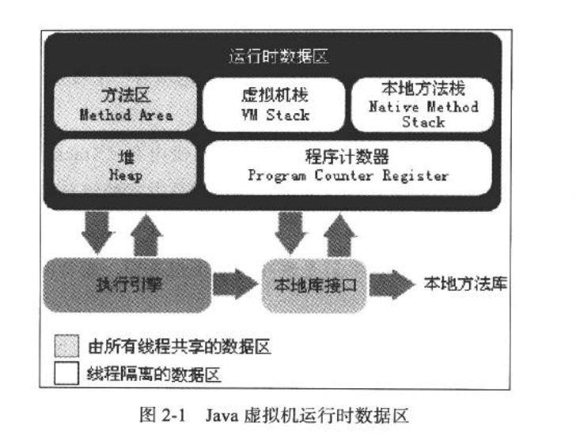
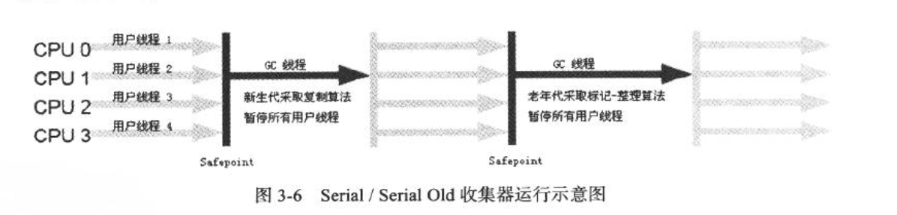
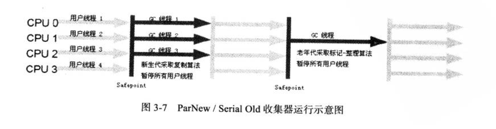
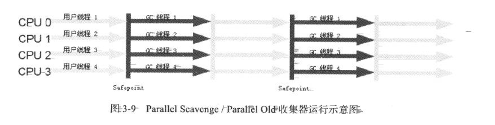
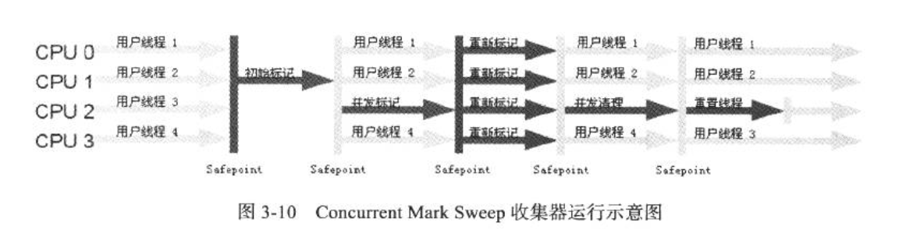
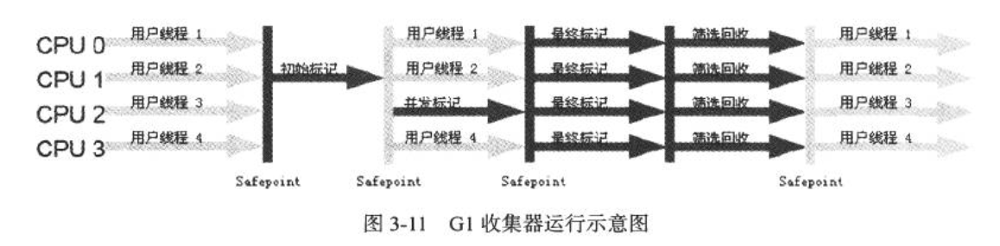
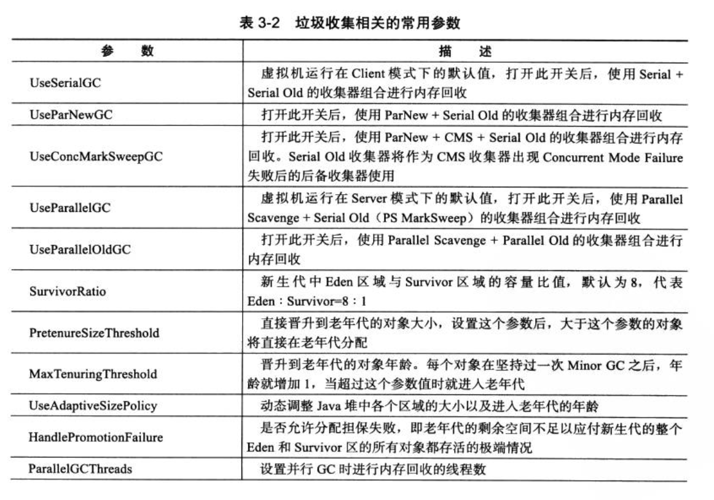

# 自动内存管理机制

## JVM 内存区域划分



### 1. 程序计数器（Program Counter Register ）

一块较小的内存区域，可以看做是当前线程执行字节码的行号指示器。字节码解释器就是通过 改变这个计数器的值来决定下一条要读取的字节码指令。分支、循环、异常处理都需要依赖它完成。

为了满足线程切换的需求，这块区域是**线程私有**的。

如果线程正在执行的是一个 Java 方法，这个计数器记录的是正在执行的字节码指令地址；而如果执行的是 Native 方法 ，这个计数器的值为空\(Undefined\)。

此内存区域是Java虚拟机规范中唯一一个没有规定任何 OutOfMemeoryError 的区域。

### 2. Java 虚拟机栈（JVM Stacks）

线程私有的内存区域，生命周期与线程相同。

虚拟机栈描述了Java 方法执行的内存模型：每个方法执行时都会创建一个栈帧（Stack Frame）用于存储局部变量表、操作数栈、动态链接、方法出口等信息；而一个方法从开始执行到执行完成的过程，就对应了一个栈帧的入栈和出栈。

局部变量表存放了编译期可知的各种基本数据类型、数据引用类型，它不等同于对象本身，而可能是指向对象起始地址的引用指针、也可能指向代表对象的句柄或一条字节码指令的地址\(returnAddress类型\)。

64位长度的long 和 double 类型会占据两个局部变量空间\(slot\)，其余的数据类型只占用一个。局部变量表所占空间在编译期完成分配，当进入一个方法时，该方法需要在栈中分配的局部变量空间是完全确定的，在方法运行期间不会改变局部变量表的大小。

在 Java 虚拟机规范中，对虚拟机栈规定了两种异常情况：

* 如果线程请求的栈深度大于虚拟机允许的最大深度，将抛出StackOverflowError
* 如果虚拟机栈可以动态扩展，但是扩展时无法申请到足够的内存，则抛出OutOfMemoryError

### 3. 本地方法栈（Native Method Stack）

与Java 虚拟机栈作用类似，区别主要自安于本地方法栈为Native方法服务，而虚拟机栈为 Java 方法服务。

与虚拟机栈一样，本地方法栈区域也会抛出 StackOverflowError 和 OutOfMemoryError。

### 4. Java 堆（Java Heap）

一块**线程共享**的区域，在虚拟机启动时创建，用于存放对象实例。Java 虚拟机规范规定**所有的 对象和数组都要在堆上分配。**

Java 堆是垃圾收集器管理的主要区域，可以处于不连续的内存空间，只要逻辑上连续即可。在实现时，既可以是固定大小的，又可以是可扩展的。

如果堆上没有足够内存完成对象分配，且不可扩展时，会抛出 OutOfMemoryError。

### 5. 方法区（Method Area）

也是线程共享的内存区域，用于存储被虚拟机加载的类信息、常量、静态变量、即时编译器编译后的代码等数据。

Java 虚拟机规范对方法区的限制非常宽松，除了像Java堆一样不使用连续内存空间和可以选择固定大小和可扩展外， 还可以选择不实现垃圾回收。对方法区的内存回收主要针对常量的回收和类型的卸载，但类型的卸载条件较为苛刻，因此在这个区域的垃圾回收可能效果不令人满意。但回收又是必要的，否则可能引发内存泄漏。

当方法区无法满足内存分配需求时，将抛出 OutOfMemoryError。

#### 运行时常量池（Runtime Constant Pool）

**方法区的一部分**，Class 文件除了类的版本、字段、方法、接口等描述信息，还有常量池（Constant Pool Table），用于存放编译器生成的各种字面量和符号引用，这部分内容将在类加载后进入方法区的运行时常量池存放。

Java 虚拟机规范对运行时常量池没有做任何细节要求。

运行时常量池相对于Class文件的常量池的一个重要特性就是动态性，Java 语言并没有规定常量只能在编译期产生，运行期间也可以将新的常量放入池中，例如 String 的 intern\(\) 方法。

运行时常量池收方法区内存限制，无法再申请到内存时将抛出 OutOfMemoryError。

### 6. 直接内存（Direct Memory）

不是虚拟机运行时数据区的一部分，也不是 Java 虚拟机规范中定义的内存区域。

JDK 1.4 加入了 NIO 类，引入了一种基于通道（Channel）和缓冲区\(Buffer\)的IO方式，它可以使用native方法 直接申请堆外内存，然后通过一个存储在堆中的 DirectByteBuffer 对象作为这块内存的引用来对其进行操作。这样避免了在 Java堆和native堆中的数据复制，能显著提高性能。

直接内存不受Java堆大小限制，但会受内存大小和 CPU 寻址空间限制，内存不足时抛出 OutOfMemoryError。

## 如何判断对象已死？

### 引用计数法

给对象增加一个引用计数器，当有地方引用时，计数器的值加1；当引用失效时，计数器减1；计数器为0时则对象不再被引用。

实现简单、效率高，致命缺点是无法解决循环引用问题：

```text
class Instance{
   Instance ins;
}

public static void main(String... args){
    Instance a = new Instance();
    Instance b = new Instance();
    a.ins = b;
    b.ins = a;
    //gc
    System.gc();
    //按照引用计数法，则a和b应该不会被回收，实际上 a 和 b 会被回收 
}
```

### 可达性分析

通过一系列成为"GC Roots" 的对象作为起始点向下搜索，经过的路径为引用链\(Reference Chain\)，当一个对象到 GC Root 没有任何引用链相连\(即GC Root 到此对象不可达\)，则证明此对象是不可用的，可以被回收。

Java 语言中，可以作为 GC Root 的对象有：

* 虚拟机栈（栈帧中的本地变量表）中引用的对象
* 方法区中类静态属性引用的对象
* 方法区中常量引用的对象
* 本地方法栈中 JNI 引用的对象

### 对象死亡前的标记过程（finalize 方法的作用）

即便在可达性分析中不可达的对象，也并非是「非死不可」，而是处于「缓刑」阶段。要真正宣告一个对象的死亡，要至少经历两个标记过程：**如果对象在进行可达性分析后发现没有与 GC Root 的引用链，那它会被第一次标记并进行一次筛选**，筛选条件是是否有必要执行 finalize 方法。当对象没有重写 finalize 方法或者 finalize 方法已经执行过，则被认为「没有必要执行」。

如果对象被判定为有必要执行 finalize 方法，则会被放到一个 F-Queue 中，并在稍后由一个虚拟机创建的、优先级低的Finalizer线程去执行它。所谓的「执行」指的是触发这个方法，但不会等待它执行结束。因为如果一个对象的finalize方法执行缓慢或者发生死循环，将会导致F-Queue中的其他对象处于等待状态，甚至导致整个回收系统崩溃。

finalize 方法是逃脱死亡命运的最后一次机会，**稍后GC将会对F-Queue 中的对象进行第二次小规模标记，**如果对象此时没有与引用链上的对象发生联系，那么基本上就回被回收掉了。

> 对象可以在 finalize 方法中将自己与引用链上的对象建立联系来逃脱被回收的命运，不过需要注意的是 finalize 方法只会被执行一次。
>
> finalize 方法执行不确定性大、无法保证各个对象的调用顺序，与C++中的析构函数并不等同，所以在大多数情况下可以忽略这个方法的存在。


## 四种引用类型

在 JDK 1.2 后，Java 对引用类型进行了扩充，将引用分为强、软、弱、虚四种。

### 强引用（Strong Reference）

形如 `Object a = new Object()`的引用，只要对象的强引用存在，垃圾收集器就算抛出 OOM 也永远不会回收此对象

### 软引用（Soft Reference）

用来描述有用但非必须的对象。对于软引用关联的对象，在即将抛出OOM之前，会将它们进行一次回收，如果回收完空间还是不够，才抛出 OOM。JDK 提供了 `SoftReference` 来实现软引用。

### 弱引用（Weak Reference）

**描述非必须的对象，比软引用更弱一些，被弱引用关联的对象只能生存到下一次垃圾回收之前**。当垃圾收集器工作时，无论内存是否够用，都会回收只被弱引用关联的对象。JDK 提供 `WeakReference` 实现了弱引用。

> 通常用于避免内存泄漏。比如[Handler的使用](https://wenhaiz.xyz/use-handler-correctly)

### 虚引用（Phantom Reference）

最弱的引用关系，不影响对象的生存时间，**无法通过虚引用获取对象实例。**为对象设置虚引用的目的就是在对象被垃圾收集器回收时收到一个系统通知。JDK 提供了`PhantomReference` 实现虚引用。

## 垃圾回收算法

### 标记-清除算法

> 最基本的垃圾回收算法，其他算法都是基于此优化而来。

算法分成「标记」和「清除」两个阶段：先对对象进行标记，然后对需要回收的对象进行回收。

缺点：

* 标记和清除效率不是很高
* **容易产生大量的内存碎片**，导致大对象申请空间时由于没有连续的空间而不得不再次进行垃圾回收。

### 复制算法

将可用内存分成两份，每次只使用其中一份，当空间不足时，将不需要清理的对象移到另一块空间中，然后把当前空间一次性清理掉。

优点：

* 实现简单，运行高效
* 每次复制直接移动堆顶指针，按序分配内存，**无内存碎片问题**

缺点：

* 可用内存空间缩小了一半
* 在对象存活率较高时，将会触发更多复制操作，效率变低

### 标记-整理算法

标记阶段与标记清除类似，在「整理」过程中，将存活对象向一端移动，然后清理掉边界以外的空间，有效的避免了内存碎片问题。适合对象存活率较高的情况。

### 分代收集

根据对象存活周期不同，将内存划分为不同区域，一般是把 Java 内存划分为新生代和老年代，这样可以根据各个年代的对象存活特点采用不同的垃圾回收算法——新生代对象存活率较低，采用复制算法；老年代对象存活率较高，需要采用标记-清除或标记-整理算法。

## 垃圾收集器

### Serial 收集器

最基本的、发展历史最悠久的收集器。**单线程**的收集器，**进行收集时必须停止其他所有线程**，直到收集结束（Stop the World）。

简单高效，适合 Client 模式下的虚拟机。



### Serial Old

Serial 老年代版本，采用**标记-整理**算法 。

### ParNew 收集器

Serial 收集器的多线程版本，适用于新生代 。



除 Serial 外，目前只有它能和 CMS 一起工作。

### Parallel Scavenge

新生代收集器，采用复制算法。目标是达到可控制的吞吐量（吞吐量=运行用户代码时间/\(运行用户代码时间+垃圾收集时间\)），可以进行参数自适应调节。

### Parallel Old

Parallel Scavenge 的老年代版本，使用多线程和标记整理算法。



### CMS收集器\(Concurrent Mark Sweep\)

以**获取最短回收停顿时间为目标**的收集器。基于标记-清除算法,整个过程分为四个步骤：

* 初始标记（intial mark）,需要 Stop the World，仅标记 GC Root 直接关联的对象，速度很快
* 并发标记（concurrent mark），GC Root Tracing，从GC root 向下搜索
* 重新标记 （remark），需要 Stop the World，修正并发标记期间由于程序运行导致标记产生变动的那部分对象的标记记录，停顿时间比初始标记长
* 并发清除 （concurrent sweep）

> 停顿两次

整个过程中耗时最长的并发标记、并发清除过程收集器线程都可以与用户线程一起工作，总体上说，CMS 收集器的内存回收过程是与用户线程一起并发执行的。



优点：

* 并发收集
* 低停顿

缺点：

* 对CPU资源敏感，并发阶段会使 CPU 吞吐量变低，程序变慢
* 无法处理浮动垃圾（并发清理阶段用户程序产生的新垃圾）
* 由于并发清理阶段用户程序还在运行，因此要预留一部分空间给用户线程使用，不能等老年代几乎快满时再启动垃圾回收。要是CMS运行期间预留的内存不够用户线程使用，会出现“Concurrent Mode Failure”，这时会临时启动 Serial Old 进行垃圾收集，这样停顿时间就长了。因此预留比例不宜过高。
* 标记-清除算法产生大量内存碎片，可能在申请大内存时提前触发 GC。**可以通过配置在Full GC时开启内存整理过程，也可以指定在进行多少次不压缩的GC后进行一次压缩GC**。

### G1 收集器（Garbage First）

面向服务端应用的垃圾收集器，JDK 1.7开始引入。

优点：

* 并行与并发：G1能充分利用多 CPU、多核的硬件优势，来缩短Stop the World 停顿时间
* 分代收集
* 空间整合：整体基于标记整理算法，从局部（两个 region）看基于复制算法，不会产生内存碎片
* **可预测停顿**：能让使用者指定在长度为M毫秒的时间片段内，消耗在垃圾收集上的时间不得超过N毫秒

G1 收集器把内存区域划分为多个大小相等的独立区域（Region），虽然保留着新生代和老年代的概念，但它们之间不再是物理隔离的，都是一部分Region的集合。

**之所以能建立可预测的停顿时间模型，是因为可以有计划的避免在Java堆中进行全区域的垃圾收集，G1跟踪各个Region里的垃圾堆积的价值大小（回收可以获得的空间大小和所需时间的经验值），且维护一个有限列表，每次根据允许的收集时间优先回收价值最大的Region。**

使用 Remembered Set 来避免全堆扫描。每个 Region 都有一个 Remembered Set。虚拟机发现程序对Reference 类型的数据进行写操作时，会产生一个Write Barrier暂时中断写操作，检查Reference 引用的对象是否位于不同的Region 之间，如果是，则将引用信息记录到被引用对象所属Region的Remembered Set中。当进行内存回收时，**在GC根节点枚举 范围增加 Remembered Set 即可保证不对全堆扫描。**

运行步骤：

* 初始标记：标记 GC root关联对象
* 并发标记：可达性分析
* 最终标记：修正标记期间因程序运行导致标记变动的部分
* 筛选回收：对各Region的回收成本和价值进行排序，然后根据用户期望的收集时间制定收集计划



### 垃圾收集器配置参数



### 

## 内存分配和回收策略

列出的策略只是普遍规则，并不是百分之百固定的，取决于使用的哪种垃圾收集器以及虚拟机相关配置。

### 对象优先在 Eden 区分配

大多数情况下，对象在新生代 Eden 区进行分配，当 Eden 区没有足够空间时，将触发一次 Minor GC。

> Minor GC:发生在新生代的GC，发生较频繁，速度较快。

> Major GC（Full GC）：发生在老年代的GC，速度较慢。

### 大对象直接进入老年代

大对象就是需要大量连续内存空间的对象 。经常出现大对象容易提前出发 GC，并且应当尽量避免「短命大对象」。

可以通过-XX:PretenureSizeThreshold参数配置对象大小超过这个值直接进入老年代。

### 长期存活的对象放入老年代

虚拟机给对象设置了年龄计数器，从Eden区分配后，经过第一次 Minor GC 后依旧存活会被放入 Survivor 区，且年龄计数器加1，以后每熬过一次Minor GC，年龄就加1，到达一定年龄会被放入老年代。这个 阈值可以通过 -XX:MaxTenuringThreshold 设置 。

### 动态年龄判断

为了能更好适应不同程序的内存情况，虚拟机并不是永远要求对象的年龄超过某个值才进入老年代，如果在 Survivor 空间中相同年龄的所有对象的总和超过了Survivor空间一半，大于等于该年龄的对象及可以直接进入老年代，无需等到超过 MaxTenuringThreshold 设置的年龄。

### 空间分配担保

在发生Minor GC前，虚拟机会检查老年代最大可用连续空间是否大于新生代所有对象总空间，如果条件成立，那么 Minor GC 就是安全的。

如果不成立，则查看HandlePromotionFailure是否允许担保失败。如果允许，则继续检查老年代最大可用连续空间是否大于 历次晋升到老年代对象的平均大小，如果大于，则尝试进行有风险的 Minor GC；如果小于或者HandlePromotionFailure不允许担保失败，则进行Major GC。

> 冒险：新生代采用复制算法，只使用一个 Survivor 空间进行备份，如果Minor GC 后有大量对象存活，就需要把Survivor 空间无法容纳的对象放入老年代。而一次回收后会有多少对象存活是未知的，所以只能取历次晋升到老年代对象大小的平均值。但如果某次Minor GC 后对象大小超过平均值 ，会出现担保失败，还是会触发 Full GC。


